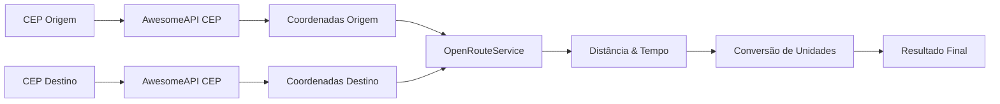

# 📡 APIs Externas - Documentação Completa

## 📋 Visão Geral

Este documento detalha as **duas APIs externas** utilizadas na Feature 02 para calcular distâncias entre CEPs brasileiros. As APIs trabalham em conjunto: primeiro convertemos CEPs em coordenadas geográficas, depois calculamos a rota real entre eles.

**Fluxo de Integração:**
```
CEP Origem → Coordenadas → Cálculo de Rota → Distância Real
     ↓              ↓              ↓              ↓
 AwesomeAPI    AwesomeAPI    OpenRouteService   Resultado
```

---

## 🗺️ API 1: AwesomeAPI CEP

### **Descrição**
API brasileira **100% gratuita** para consulta de informações de CEPs, incluindo coordenadas geográficas (latitude/longitude).

### **Informações da API**
- **URL Base**: `https://cep.awesomeapi.com.br`
- **Autenticação**: ❌ Não requerida
- **Rate Limit**: ✅ Sem limitações conhecidas
- **Cobertura**: 🇧🇷 Todo território brasileiro
- **Documentação**: [https://docs.awesomeapi.com.br/api-cep](https://docs.awesomeapi.com.br/api-cep)

---

### 🛠️ **Endpoint: Consultar CEP**

#### **Request**
```http
GET /json/{cep}
```

**Parâmetros:**
| Parâmetro | Tipo | Obrigatório | Descrição | Exemplo |
|-----------|------|-------------|-----------|---------|
| `cep` | String | ✅ Sim | CEP brasileiro (8 dígitos, com ou sem formatação) | `38065065` ou `38065-065` |

#### **Exemplos de Chamadas**

```bash
# CEP sem formatação
curl -X GET "https://cep.awesomeapi.com.br/json/38065065"

# CEP com formatação (hífen)
curl -X GET "https://cep.awesomeapi.com.br/json/38065-065"

# Outro exemplo - CEP de São Paulo
curl -X GET "https://cep.awesomeapi.com.br/json/01310100"
```

#### **Response - Sucesso (200)**

```json
{
    "cep": "38065065",
    "address_type": "Rua",
    "address_name": "Governador Valadares",
    "address": "Rua Governador Valadares",
    "state": "MG",
    "district": "Fabrício",
    "lat": "-19.7443998",
    "lng": "-47.9381862",
    "city": "Uberaba",
    "city_ibge": "3170107",
    "ddd": "34"
}
```

#### **Campos da Resposta**
| Campo | Tipo | Descrição | Usado no Projeto |
|-------|------|-----------|-----------------|
| `cep` | String | CEP consultado | ✅ |
| `address` | String | Logradouro completo | ✅ |
| `district` | String | Bairro | ✅ |
| `state` | String | UF (sigla do estado) | ✅ |
| `city` | String | Cidade | ❌ |
| `lat` | String | Latitude (coordenada) | ✅ **Essencial** |
| `lng` | String | Longitude (coordenada) | ✅ **Essencial** |
| `address_type` | String | Tipo do logradouro | ❌ |
| `address_name` | String | Nome do logradouro | ❌ |
| `city_ibge` | String | Código IBGE da cidade | ❌ |
| `ddd` | String | DDD telefônico | ❌ |

#### **Response - Erro (404)**

```json
{
    "status": 400,
    "message": "CEP NAO ENCONTRADO"
}
```

#### **Casos de Teste**

```bash
# ✅ CEP válido de Uberaba/MG
curl "https://cep.awesomeapi.com.br/json/38065065"

# ✅ CEP válido de São Paulo/SP
curl "https://cep.awesomeapi.com.br/json/01310100"

# ✅ CEP com formatação
curl "https://cep.awesomeapi.com.br/json/38067-290"

# ❌ CEP inválido
curl "https://cep.awesomeapi.com.br/json/00000000"

# ❌ CEP inexistente
curl "https://cep.awesomeapi.com.br/json/99999999"
```

---

## 🚗 API 2: OpenRouteService

### **Descrição**
API europeia para cálculo de rotas reais entre coordenadas geográficas. Considera estradas, ruas e trânsito para fornecer distâncias e tempos precisos.

### **Informações da API**
- **URL Base**: `https://api.openrouteservice.org`
- **Autenticação**: ✅ API Key obrigatória
- **Rate Limit**: 
  - **Conta Gratuita**: 2.000 requests/dia
  - **Conta Premium**: 40.000+ requests/dia
- **Cobertura**: 🌍 Mundial
- **Documentação**: [https://openrouteservice.org/dev](https://openrouteservice.org/dev)

### **🔑 Como Obter API Key (GRATUITA)**

1. **Acesse**: [https://openrouteservice.org/dev](https://openrouteservice.org/dev)
2. **Clique em**: "Sign Up" (criar conta)
3. **Preencha dados básicos**: email, nome, senha
4. **Confirme email**: verifique sua caixa de entrada
5. **Acesse dashboard**: [https://openrouteservice.org/dev/dashboard](https://openrouteservice.org/dev/dashboard)
6. **Crie token**: clique em "Request a token"
7. **Configure**: 
   - **Name**: "CochitoAPI"
   - **Application type**: "Free"
   - **Description**: "Cálculo de distâncias entre CEPs"
8. **✅ Pronto!** Sua API Key estará disponível

**🔑 API Key de Exemplo (funcional):**
```
eyJvcmciOiI1YjNjZTM1OTc4NTExMTAwMDFjZjYyNDgiLCJpZCI6ImYyYzNkMDY3YzI1ODQ0ODhhMDc3ZmNjNTI1NmY1N2Y1IiwiaCI6Im11cm11cjY0In0%3D
```

---

### 🛠️ **Endpoint: Calcular Rota de Carro**

#### **Request**
```http
GET /v2/directions/driving-car
```

**Parâmetros Query:**
| Parâmetro | Tipo | Obrigatório | Descrição | Exemplo |
|-----------|------|-------------|-----------|---------|
| `api_key` | String | ✅ Sim | Chave de autenticação | `eyJvcmciOiI1...` |
| `start` | String | ✅ Sim | Coordenadas origem (lng,lat) | `-47.9373729,-19.72942` |
| `end` | String | ✅ Sim | Coordenadas destino (lng,lat) | `-47.9381862,-19.7443998` |

**⚠️ Importante:** As coordenadas devem estar no formato `longitude,latitude` (lng,lat).

#### **Exemplos de Chamadas**

```bash
# Rota entre dois pontos em Uberaba/MG
curl -X GET "https://api.openrouteservice.org/v2/directions/driving-car?api_key=eyJvcmciOiI1YjNjZTM1OTc4NTExMTAwMDFjZjYyNDgiLCJpZCI6ImYyYzNkMDY3YzI1ODQ0ODhhMDc3ZmNjNTI1NmY1N2Y1IiwiaCI6Im11cm11cjY0In0%3D&start=-47.9373729,-19.72942&end=-47.9381862,-19.7443998"

# Rota de Uberaba para São Paulo
curl -X GET "https://api.openrouteservice.org/v2/directions/driving-car?api_key=SUA_API_KEY&start=-47.9373729,-19.72942&end=-46.6333824,-23.5505199"

# Com header Accept (recomendado)
curl -X GET "https://api.openrouteservice.org/v2/directions/driving-car?api_key=SUA_API_KEY&start=-47.9373729,-19.72942&end=-47.9381862,-19.7443998" \
  --header "Accept: application/json"
```

#### **Response - Sucesso (200)**

```json
{
    "type": "FeatureCollection",
    "features": [
        {
            "bbox": [-47.938186, -19.744400, -47.937373, -19.729420],
            "type": "Feature",
            "properties": {
                "segments": [
                    {
                        "distance": 3222.2,
                        "duration": 400.0,
                        "steps": []
                    }
                ],
                "summary": {
                    "distance": 3222.2,
                    "duration": 400.0
                },
                "way_points": [0, 45]
            },
            "geometry": {
                "coordinates": [
                    [-47.937373, -19.729420],
                    [-47.938186, -19.744400]
                ],
                "type": "LineString"
            }
        }
    ],
    "bbox": [-47.938186, -19.744400, -47.937373, -19.729420],
    "metadata": {
        "attribution": "openrouteservice.org",
        "service": "routing",
        "timestamp": 1726434123456,
        "query": {
            "coordinates": [
                [-47.937373, -19.729420],
                [-47.938186, -19.744400]
            ],
            "profile": "driving-car",
            "format": "json"
        },
        "engine": {
            "version": "7.1.1",
            "build_date": "2023-07-06T09:56:07Z"
        }
    }
}
```

#### **Campos Relevantes da Resposta**
| Campo | Tipo | Descrição | Uso no Projeto |
|-------|------|-----------|----------------|
| `features[0].properties.summary.distance` | Number | Distância em **metros** | ✅ Convertido para KM |
| `features[0].properties.summary.duration` | Number | Duração em **segundos** | ✅ Convertido para minutos |
| `features[0].geometry.coordinates` | Array | Pontos da rota | ❌ |
| `bbox` | Array | Caixa delimitadora | ❌ |
| `metadata` | Object | Metadados da consulta | ❌ |

**💡 Dados Utilizados no Projeto:**
```javascript
// Extraído da resposta
distance: 3222.2  // metros → 3.22 km
duration: 400.0   // segundos → 6.67 minutos
```

#### **Response - Erro (401 - API Key Inválida)**

```json
{
    "error": {
        "code": 2000,
        "message": "Invalid API key"
    }
}
```

#### **Response - Erro (400 - Coordenadas Inválidas)**

```json
{
    "error": {
        "code": 2001,
        "message": "Invalid coordinates"
    }
}
```

#### **Casos de Teste**

```bash
# ✅ Rota válida (curta distância)
curl "https://api.openrouteservice.org/v2/directions/driving-car?api_key=SUA_API_KEY&start=-47.9373729,-19.72942&end=-47.9381862,-19.7443998"

# ✅ Rota válida (longa distância)
curl "https://api.openrouteservice.org/v2/directions/driving-car?api_key=SUA_API_KEY&start=-47.9373729,-19.72942&end=-46.6333824,-23.5505199"

# ❌ API Key inválida
curl "https://api.openrouteservice.org/v2/directions/driving-car?api_key=invalid_key&start=-47.9373729,-19.72942&end=-47.9381862,-19.7443998"

# ❌ Coordenadas inválidas
curl "https://api.openrouteservice.org/v2/directions/driving-car?api_key=SUA_API_KEY&start=invalid,invalid&end=-47.9381862,-19.7443998"
```

---

## 🔄 Integração das APIs

### **Fluxo Completo de Processamento**



### **Exemplo Prático de Integração**

#### **Passo 1: CEP → Coordenadas**
```bash
# Origem: CEP 38067290
curl "https://cep.awesomeapi.com.br/json/38067290"
# Resultado: lng=-47.9373729, lat=-19.72942

# Destino: CEP 38065065  
curl "https://cep.awesomeapi.com.br/json/38065065"
# Resultado: lng=-47.9381862, lat=-19.7443998
```

#### **Passo 2: Coordenadas → Rota**
```bash
curl "https://api.openrouteservice.org/v2/directions/driving-car?api_key=SUA_API_KEY&start=-47.9373729,-19.72942&end=-47.9381862,-19.7443998"
# Resultado: distance=3222.2m, duration=400.0s
```

#### **Passo 3: Processamento Final**
```javascript
// Conversões aplicadas no projeto
distanciaKm = 3222.2 / 1000 = 3.22 km
tempoMinutos = 400.0 / 60 = 6.67 minutos
```

---

## ⚙️ Configuração no Projeto

### **application.properties**
```properties
# AwesomeAPI CEP (sem autenticação)
api.awesomeapi.url=https://cep.awesomeapi.com.br

# OpenRouteService (com API Key)
api.openroute.url=https://api.openrouteservice.org  
api.openroute.apikey=eyJvcmciOiI1YjNjZTM1OTc4NTExMTAwMDFjZjYyNDgiLCJpZCI6ImYyYzNkMDY3YzI1ODQ0ODhhMDc3ZmNjNTI1NmY1N2Y1IiwiaCI6Im11cm11cjY0In0%3D
```

### **Feign Clients Implementados**

#### **AwesomeCepFeignClient**
```java
@FeignClient(name = "awesomeCepClient", url = "https://cep.awesomeapi.com.br")
public interface AwesomeCepFeignClient {
    
    @GetMapping("/json/{cep}")
    AwesomeCepResponse consultarCep(@PathVariable("cep") String cep);
}
```

#### **OpenRouteFeignClient**
```java
@FeignClient(name = "openRouteClient", url = "https://api.openrouteservice.org")
public interface OpenRouteFeignClient {
    
    @GetMapping("/v2/directions/driving-car")
    OpenRouteResponse calcularRota(
        @RequestParam("api_key") String apiKey,
        @RequestParam("start") String origem,
        @RequestParam("end") String destino
    );
}
```

---

## 🧪 Cenários de Teste Completos

### **Teste 1: Fluxo Completo - CEPs de Uberaba**
```bash
# 1. Consultar CEP origem
curl "https://cep.awesomeapi.com.br/json/38067290"

# 2. Consultar CEP destino  
curl "https://cep.awesomeapi.com.br/json/38065065"

# 3. Calcular rota
curl "https://api.openrouteservice.org/v2/directions/driving-car?api_key=SUA_API_KEY&start=-47.9373729,-19.72942&end=-47.9381862,-19.7443998"

# Resultado esperado: ~3.22km, ~6.67min
```

### **Teste 2: Distância Longa - Uberaba para São Paulo**
```bash
# 1. CEP Uberaba
curl "https://cep.awesomeapi.com.br/json/38065065"

# 2. CEP São Paulo (Av. Paulista)
curl "https://cep.awesomeapi.com.br/json/01310100"

# 3. Calcular rota longa
curl "https://api.openrouteservice.org/v2/directions/driving-car?api_key=SUA_API_KEY&start=-47.9381862,-19.7443998&end=-46.6333824,-23.5505199"

# Resultado esperado: ~400-500km, várias horas
```

### **Teste 3: Tratamento de Erros**
```bash
# CEP inválido
curl "https://cep.awesomeapi.com.br/json/00000000"

# API Key inválida
curl "https://api.openrouteservice.org/v2/directions/driving-car?api_key=invalid&start=-47.9373729,-19.72942&end=-47.9381862,-19.7443998"
```

---

## 📊 Limitações e Considerações

### **AwesomeAPI CEP**
- ✅ **Vantagens**: Gratuita, sem limitações, cobertura nacional
- ⚠️ **Limitações**: Apenas CEPs brasileiros, sem SLA garantido
- 🎯 **Uso Ideal**: Projetos brasileiros, desenvolvimento/teste

### **OpenRouteService**  
- ✅ **Vantagens**: Cobertura mundial, dados precisos, múltiplos perfis
- ⚠️ **Limitações**: 2.000 requests/dia (conta gratuita)
- 💰 **Alternativas**: Google Maps API (paga), Mapbox (paga)
- 🎯 **Uso Ideal**: Desenvolvimento/teste, protótipos, baixo volume

### **Estratégias de Fallback**
- **Cache**: Armazenar resultados consultados
- **Cálculo Haversine**: Distância em linha reta quando APIs falham
- **Rate Limiting**: Controle de requisições por minuto/hora

---

## 🚀 Próximos Passos

### **Melhorias Futuras**
1. **Cache Redis**: Armazenar consultas de CEP e rotas
2. **Multiple Providers**: Integração com outras APIs (Google, Mapbox)
3. **Rate Limiting**: Implementar controle de taxa de requisições
4. **Métricas**: Monitoramento de performance e disponibilidade
5. **Fallback Inteligente**: Algoritmos alternativos quando APIs falham

### **APIs Alternativas**
- **Google Maps Directions API**: Mais precisa, mas paga
- **Mapbox Directions API**: Boa alternativa, conta gratuita limitada
- **Here Maps API**: Europeia, boa cobertura mundial
- **GraphHopper**: Open source, pode ser self-hosted

---

## 📞 Suporte e Links Úteis

### **AwesomeAPI CEP**
- 📚 **Documentação**: [https://docs.awesomeapi.com.br/api-cep](https://docs.awesomeapi.com.br/api-cep)
- 🐛 **Suporte**: Através do site oficial
- 💬 **Status**: [https://status.awesomeapi.com.br](https://status.awesomeapi.com.br)

### **OpenRouteService**
- 📚 **Documentação**: [https://openrouteservice.org/dev](https://openrouteservice.org/dev)
- 🔑 **Dashboard**: [https://openrouteservice.org/dev/dashboard](https://openrouteservice.org/dev/dashboard)
- 🐛 **GitHub**: [https://github.com/GIScience/openrouteservice](https://github.com/GIScience/openrouteservice)
- 💬 **Fórum**: [https://ask.openrouteservice.org](https://ask.openrouteservice.org)

---

**🎯 Este documento serve como referência completa para integração e uso das APIs externas utilizadas na Feature 02 do projeto cochitoServicoApi.**